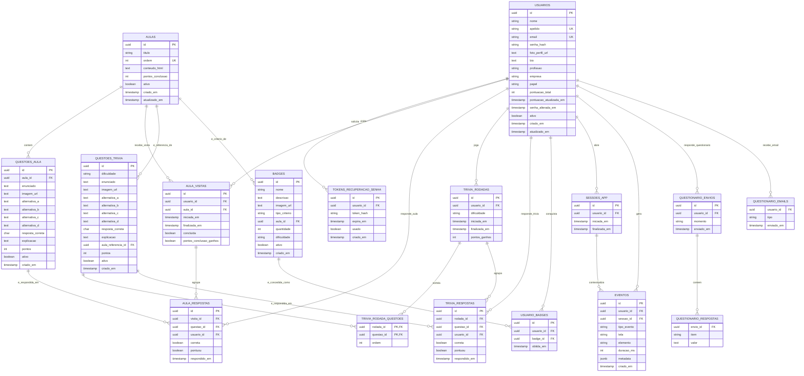

# Modelo relacional

Este é o modelo implementado em `backend/src/db/migrations/`. Ele tem duas diferenças em relação ao ERD original do TCC:

- **`trivia_rodada_questoes`** (tabela nova): guarda quais questões foram sorteadas para cada rodada.
  - O servidor só aceita respostas a essas questões.
  - A rodada pode ser retomada depois de recarregar a página.
- **`usuarios.senha_alterada_em`** (coluna nova): quando a senha muda, os JWTs emitidos antes deixam de valer.

Adições da migration `002_aulas_arquivo_e_pesquisa.sql`:

- **`aulas.slug`**: nulo nas aulas criadas pelo admin. Nas aulas importadas de `conteudo/aulas`, é a identidade da aula.
- **`questoes_aula.chave`**: identidade da questão importada (o `data-pergunta` do HTML). Vem junto com `questoes_aula.ordem`, a posição da pergunta no arquivo.
- **`usuarios.consentiu_pesquisa_em`**: data do consentimento para a pesquisa. Nulo quando não houve consentimento.
- **`sessoes_app.standalone` e `sessoes_app.largura_tela`**: contexto da sessão (app instalado ou navegador, e largura da tela).
- **Tabela `pontuacao_historico`**: `usuario_id`, `origem`, `referencia_id`, `pontos`, `total_apos` e `criado_em`. Cada crédito de pontos gera uma linha.
- **Visões `pesquisa_*`**: pseudonimizadas e filtradas por consentimento, para exportação.
- **Migration `005`**: a visão interna `sessoes_app_fim` estima o fim das sessões sem `finalizada_em` (último evento da sessão ou o início), usada por `pesquisa_sessoes` (coluna `fim_estimado`), `pesquisa_uso_diario` e `pesquisa_engajamento_usuario`; `pesquisa_badges` traz cada conquista com a data.

Adições da migration `011_questionarios.sql` (questionários pré e pós da pesquisa; o texto das perguntas fica em `backend/src/modulos/questionarios/definicao.js`):

- **Tabela `questionario_envios`**: `usuario_id`, `momento` (`pre` ou `pos`) e `enviado_em`. Único por `(usuario_id, momento)`: cada pessoa responde cada questionário uma vez.
- **Tabela `questionario_respostas`**: formato longo, uma linha por item (múltipla escolha: uma por opção marcada). `item` (código, ex.: `K1_R`) e `valor` (texto: número da escala, índice da opção ou o texto da pergunta aberta). Único por `(envio_id, item, valor)`.
- **Visão `pesquisa_questionario`**: mesmo padrão das outras `pesquisa_*`, com `participante, momento, item, valor, respondido_em`.

Adição da migration `012_questionario_emails.sql`:

- **Tabela `questionario_emails`**: e-mails do questionário pós já enviados. `usuario_id`, `tipo` (`convite_pos` ou `lembrete_pos`) e `enviado_em`. Única por `(usuario_id, tipo)`: a linha é reservada antes do envio, então cada pessoa recebe cada e-mail uma vez só.

## Regras garantidas pelo banco

- `apelido` e `email` são únicos, sem diferenciar maiúsculas de minúsculas.
- Cada questão (de aula ou de trivia) pontua só uma vez por usuário. Isso é garantido por um índice único parcial `(usuario_id, questao_id) WHERE pontuou`.
- O bônus de conclusão de cada aula é pago só uma vez por usuário. Índice único parcial `(usuario_id, aula_id) WHERE pontos_conclusao_ganhos`.
- Colunas com valores fixos têm `CHECK`: `papel`, `dificuldade`, `resposta_correta`, `tipo_criterio` e pontos maiores ou iguais a zero.

